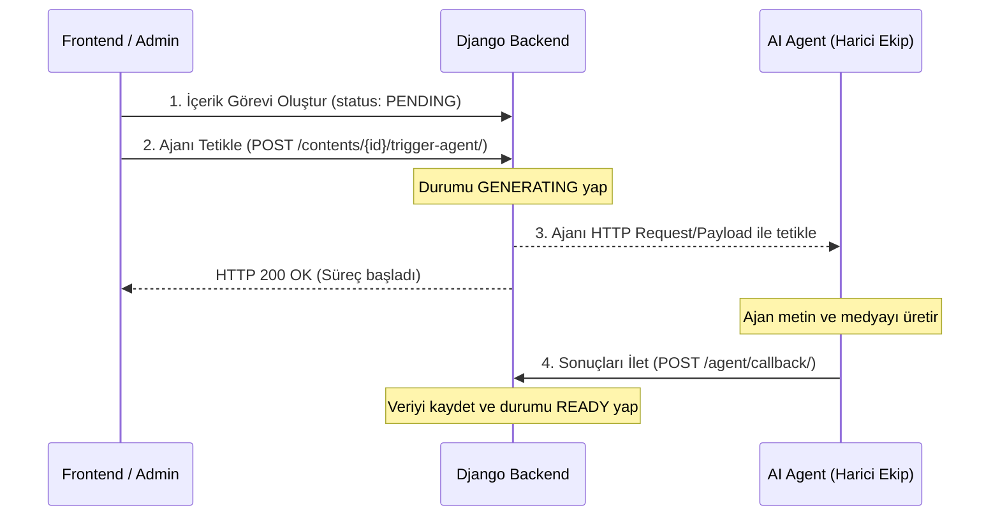

# Ainnova Digital Marketing & Advertising Backend API

Bu repo, Ainnova bünyesinde geliştirilen dijital pazarlama, sosyal medya ve reklam ihtiyaçlarını uçtan uca karşılayan yapay zeka tabanlı pazarlama ajanı platformunun **Backend API ve Veritabanı** altyapısını barındırmaktadır. Sistem, Ainnova altındaki çeşitli marka/ürün dikeylerinin (Hukuk, Sağlık vb.) tamamına hizmet verebilecek modüler bir yapıdadır.

Backend sistemi; marka profillerini, pazarlama kampanyalarını ve üretilecek içerik görevlerini saklar; bağımsız çalışan Yapay Zeka Ajanı (Agent) ile durum yönetimi (state management) ve callback (webhook) entegrasyonu sağlar.

---

## 🛠️ Teknolojiler
- **Framework:** Python + Django 5.2 & Django REST Framework (DRF)
- **Veritabanı:** PostgreSQL (Yerel testler ve geliştirme için varsayılan olarak SQLite kullanılmıştır)
- **Kimlik Doğrulama:** JWT (JSON Web Token - `djangorestframework-simplejwt`)
- **CORS Yönetimi:** `django-cors-headers` (Frontend entegrasyonları için)

---

## 📐 Veritabanı Modelleri (Şema)

Projede veriler ilişkisel bir veritabanı şeması üzerinde aşağıdaki 3 temel modelle tutulmaktadır:

### 1. `BrandProfile` (Marka Profili)
Her markanın pazarlama dilini, dikeyini ve hedeflerini tanımlar (Örn: Hukuk dikeyi için Ai-Juris, Sağlık dikeyi için Ai-Health vb.).
- `name` (CharField): Marka Adı (Örn: "Ainnova Tech")
- `vertical` (CharField): Dikey/Sektör (Örn: "Teknoloji", "Hukuk", "Sağlık")
- `target_audience` (TextField): Hedef Kitle
- `brand_voice` (CharField): Marka Tonu/Sesi (Örn: "Yenilikçi ve Profesyonel")
- `description` (TextField): Marka Açıklaması

### 2. `Campaign` (Kampanya)
Markalara ait pazarlama kampanyalarını tanımlar.
- `brand` (ForeignKey -> BrandProfile): Kampanyanın ait olduğu marka.
- `name` (CharField): Kampanya Başlığı.
- `objective` (TextField): Kampanya Hedefi.
- `start_date` (DateField): Başlangıç Tarihi.
- `end_date` (DateField): Bitiş Tarihi.
- `budget` (DecimalField): Kampanya Bütçesi.
- `status` (CharField): Durum (`DRAFT` [Taslak], `ACTIVE` [Aktif], `COMPLETED` [Tamamlandı]).

### 3. `MarketingContent` (Pazarlama İçeriği)
Ajan tarafından üretilen veya üretilecek olan her bir sosyal medya veya reklam içeriğini temsil eder.
- `campaign` (ForeignKey -> Campaign): İçeriğin ait olduğu kampanya.
- `platform` (CharField): Yayınlanacağı platform (`LINKEDIN`, `X`, `INSTAGRAM`, `FACEBOOK`, `GOOGLE_ADS`, `META_ADS`, `BLOG`, `EMAIL`).
- `content_type` (CharField): İçerik tipi (`TEXT` [Sadece Metin], `IMAGE` [Metin & Görsel], `VIDEO` [Metin & Video]).
- `status` (CharField): İçeriğin üretim aşaması:
  - `PENDING`: Ajanın tetiklenmesi bekleniyor.
  - `GENERATING`: Ajan şu an bu içeriği üretiyor.
  - `READY`: Üretim tamamlandı, incelemeye hazır.
  - `FAILED`: Üretim esnasında bir hata oluştu.
  - `PUBLISHED`: İçerik yayında.
- `generated_text` (TextField): Ajanın ürettiği nihai metin/kopya.
- `media_url` (URLField): Ajanın ürettiği görsel veya videonun adresi.

---

## 🔄 Yapay Zeka Ajanı (Agent) Entegrasyon Akışı

Ajan sistemi ile backend, asenkron bir **Webhook (Callback)** mimarisiyle haberleşir:



---

## 🚀 Kurulum ve Çalıştırma

### 1. Gereksinimler
- Python 3.10+ kurulu olmalıdır.

### 2. Projeyi İndirme ve Ortam Kurulumu
Projeyi yerelde çalıştırmak için terminalden şu adımları izleyin:

```bash
# Bağımlılıkları yükleyin
source venv/bin/activate
pip install -r requirements.txt

# Veritabanını hazırlayın
python manage.py migrate

# Yönetici hesabı oluşturun
python manage.py createsuperuser

# Sunucuyu başlatın
python manage.py runserver
```

Sunucu varsayılan olarak **`http://127.0.0.1:8000/`** adresinde çalışmaya başlayacaktır.

---

## 🔗 API Uç Noktaları (Endpoints)

Tüm API uç noktaları `/api/` önekiyle başlar.

### Yetkilendirme (Authentication)
* `POST /api/token/` -> Kullanıcı adı ve şifre ile JWT token çifti (access/refresh) alır.
* `POST /api/token/refresh/` -> Access token süresi bittiğinde refresh token ile yeni bir access token üretir.

> [!NOTE]
> Ajan callback ucu hariç diğer tüm API uç noktaları istek başlığında (Header) **`Authorization: Bearer <access_token>`** bilgisini zorunlu kılar.

### Core API'ler (CRUD)
* `GET/POST /api/brands/` -> Marka profillerini listeler veya yeni marka ekler.
* `GET/POST/PUT/DELETE /api/campaigns/` -> Kampanya yönetimi.
  - *Filtreleme:* `/api/campaigns/?brand_id=<id>` şeklinde markaya göre süzülebilir.
* `GET/POST/PUT/DELETE /api/contents/` -> İçerik görevlerini yönetir.
  - *Filtreleme:* `/api/contents/?campaign_id=<id>` şeklinde kampanyaya göre süzülebilir.

### Ajan Entegrasyon Endpoint'leri
* **Ajan Tetikleme:** `POST /api/contents/{id}/trigger-agent/`
  - İçeriğin durumunu `GENERATING` yapar ve ajanı çağırır.
* **Ajan Webhook (Callback):** `POST /api/agent/callback/`
  - Ajan işini bitirince bu uca istek atar. Yetkilendirme gerektirmez.
  - **İstek Gövdesi (Payload):**
    ```json
    {
      "content_id": 1,
      "status": "READY",
      "generated_text": "Yapay zeka tarafından üretilen paylaşım metni.",
      "media_url": "https://images.ainnova.com/contents/content_1.png"
    }
    ```

---

## 🧪 Testlerin Çalıştırılması

Tüm uç noktaların entegrasyon testlerini çalıştırmak için:
```bash
python manage.py test
```
